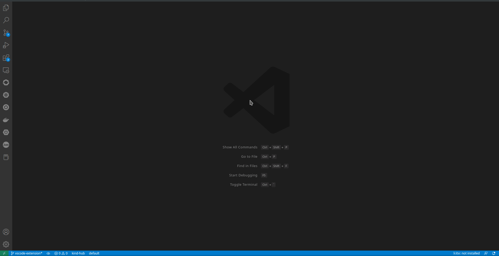
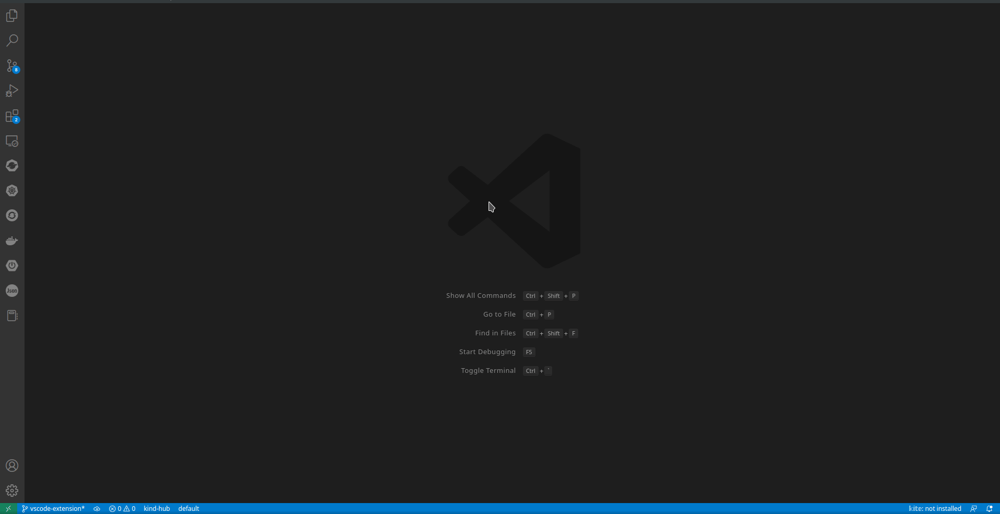

# OCM VScode Extension

[Open Cluster Management][ocm-io] (OCM) is a community-driven project focused on multicluster and multicloud scenarios for Kubernetes apps.

The OCM VScode Extension is a UI tool for OCM related Kubernetes resources.
The extension has been built upon Visual Studio Code and offers additional OCM administrative and monitoring features in order to improve operational efficiency and accelerate development within engineering teams.
The OCM VScode Extension provides tons of useful features, including easy to generate OCM related Kubernetes resources, automated local OCM environment creation and a simple and convenient monitoring view for cluster resources.
Having an effective UI tool for managing your cluster is key to a healthy environment. With the right user interface, you can administer changes to the cluster, track resources, and troubleshoot issues more efficiently, without having to use numerous additional CLI tools.

  

- [OCM VScode Extension](#ocm-vscode-extension)
  - [Prerequisites](#prerequisites)
  - [Installation](#installation)
    - [Install Latest version](#install-latest-version)
    - [Install specific version](#install-specific-version)
  - [Features](#features)
    - [Resources Snippets](#resources-snippets)
    - [Bootstrap Project](#bootstrap-project)
    - [Create Local Environment](#create-local-environment)
    - [Manage Existing Resources](#manage-existing-resources)
  - [Contributing](#contributing)

 

## Prerequisites

You must meet the following prerequisites to install the OCM VScode Extension:

* Ensure your [`Visual Studio Code`][install-vscode] release is at least `v1.71.0`.

You must meet some additional prerequisites to utilize OCM VScode Extension features:

| Feature | Prerequisites |
| ------- | ------------ |
| Resources Snippets | None |
| Bootstrap Project | None |
| Manage Existing Resources | [kubectl][install-kubectl] |
| Create Local Environment | [kubectl][install-kubectl], [clusteradm][install-clusteradm], [kind][install-kind] |

 

## Installation

### Install Latest version
In your VScode instance, go to the Extensions Marketplace (by clicking on the _Extensions_ icon in the composite bar on the left hand side or simply typing Ctrl+Shift+X).

Search for _OCM Extension_ and click install.

### Install specific version
To download a specific version of VScode Extention visit the [releases page][releases], expand the _Assets_ section of the target version,
and download the version for your operating system.

In your VScode instance, go to the Extensions Marketplace (by clicking on the _Extensions_ icon in the composite bar on the left hand side or simply typing Ctrl+Shift+X).

Click the **...** at the top right corner of the palette, select the _Install from VSIX..._ action, and browes for the specific _VSIX_ file you downloaded.

Select a _VSIX_ file and hit install.

 

## Features

### Resources Snippets

The OCM VScode Extension allows users to load Custom Resource (CR) snippets from the command palette.

The resources available as snipperts are:
  * Subscription
  * Placement
  * Channel
  * ManagedClusterSet
  * ManagedClusterSetBinding

Subscription snippets are available specifically tailored to either Git, Helm or ObjectBucket.

To exercise this feature you must take the following steps:
  1. Create a new yaml file in a desired path 
  2. Open the file and press Ctrl+Shift+P on your keyboard
  3. In the search container at the top of your screen choose _Snippets: Insert Snippet_
  4. Choose a desired snippet from list

   

 

### Bootstrap Project

Another Valuable feature of the OCM VScode Extension is to create a Bootstrap project for the various channel types.

The Bootstrap project is basically a collection of snippets, customized to fit one of three channel types - Git, Helm or ObjectBucket, that form a project template for you to build upon.

To exercise this feature you must take the following steps:
  1. Press Ctrl+Shift+P on your keyboard
  2. In the search container at the top of your screen choose _OCM: Create an application-manager project_
  3. Choose a desired channel type
  4. Type in a project name and hit enter

   

 

### Create Local Environment

The Create Local Environment feature allows you to create a quick OCM multi-cluster control plane on a local [kind][kind] environment with only a click of a button.

The feature does it all for you:
  - Verifies the existence of the required tools.
  - Creates as many [kind][kind] clusters as you need (customizable).
  - Initializes the _hub cluster_ by installing a [Cluster Manager][cluster-manager] using [clusteradm][clusteradm], and [kubectl][install-kubectl].
  - Installs a [Klusterlet][klusterlet] agent on the _managed clusters_ and sends join requests to the _hub cluster_ using [clusteradm][clusteradm], and [kubectl][install-kubectl].
  - Accepts the join requests from the _hub cluster_ using [clusteradm][clusteradm], and [kubectl][install-kubectl].

To exercise this feature you must take the following steps:
  1. Click on the _OCM_ icon in the composite bar on the left hand side to open the OCM VScode Extension control pane
  2. Locate the _Create Local Environment_ button in the _Developers Tools_ section and give it a click
  3. Notice that at the top of your screen an action container will prompt you to choose between default or custom configuration
  4. After configuration was specified, a progress bar at the botom right of your screen will provide feadback on the build process

   

 

### Manage Existing Resources

The Manage Existing Resources feature provides a wide and detailed overview of all the resources residing in any one cluster.

To exercise this feature you must take the following steps:
  1. Access the _Cluster Details_ tab either by:
      * Pressing Ctrl+Shift+P on your keyboard and choosing _OCM-View: Cluster Details_ in the search container at the top of your screen 
      * Clicking on the _OCM_ icon in the composite bar on the left hand side to open the OCM VScode Extension control pane, locating the _Connected Clusters_ section and selecting any cluster in the list
  2. Inside the _Cluster Details_ tab, use the dropdown to select any cluster from the list of availabe clusters in order to view the resources within it 

   

 

## Contributing

See our [Contributing Guidelines][repo-contribute] for more information.

<!-- LINKS -->
[ocm-io]: https://open-cluster-management.io/
[install-vscode]: https://code.visualstudio.com/download
[install-kubectl]: https://kubernetes.io/docs/tasks/tools/install-kubectl
[install-kind]: https://kind.sigs.k8s.io/docs/user/quick-start/
[install-clusteradm]:https://github.com/open-cluster-management-io/clusteradm
[releases]: https://github.com/open-cluster-management-io/ocm-vscode-extension/releases
[kind]: https://kind.sigs.k8s.io/
[cluster-manager]: https://operatorhub.io/operator/cluster-manager
[clusteradm]: https://github.com/open-cluster-management-io/clusteradm
[klusterlet]: https://operatorhub.io/operator/klusterlet
[repo-contribute]: https://github.com/open-cluster-management-io/ocm-vscode-extension/contribute