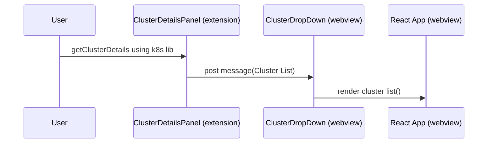
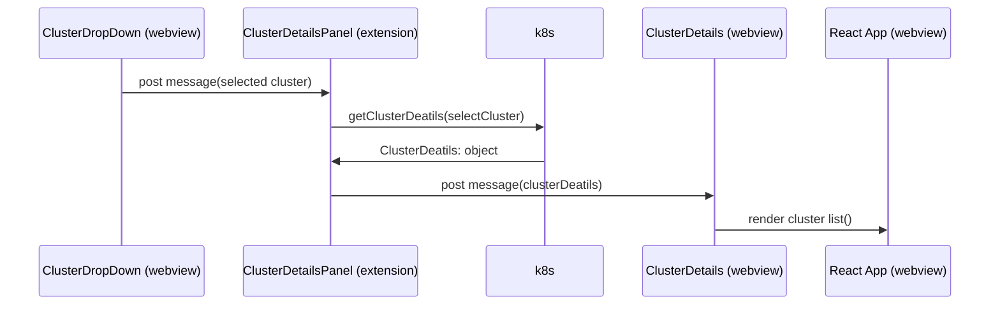

# `webview-ui` Directory

This directory contains all of the code that will be executed within the webview context. It can be thought of as the place where all the "frontend" code of a webview is contained.

Types of content that can be contained here:

- Frontend framework code (i.e. React, Svelte, Vue, etc.)
- JavaScript files
- CSS files
- Assets / resources (i.e. images, illustrations, etc.)

It is important to understand how the webview interacts with the extension.
the webview is an iframe with limited access to the backend it cannot trigger queries on the host machine, 
since we need to interact with "kubectl" lib we need to transfer data between webview & extension 

bellow you can find a Sequence Diagram discarding the GetClusterDetails scenario   

When the user chooses a cluster the webview need to request more details from the extension 

